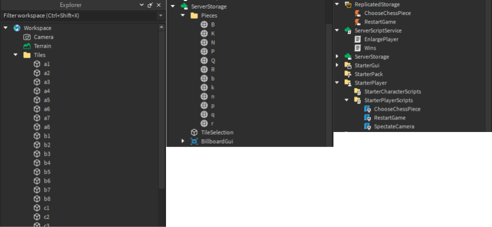

There are many videos of programming chess engines online but I found this one by Sebastian Lague to be particularly interesting.
What I enjoy is that Sebastian experiments with building a chess engine through his own medium, Unity Game Development.

The end result looked fantastic and I wanted to apply this concept to mediums I'm familiar with.
<WideMedia>
<iframe
  width="560"
  height="315"
  src="https://www.youtube-nocookie.com/embed/U4ogK0MIzqk"
  title="YouTube video player"
  frameborder="0"
  allow="accelerometer; autoplay; clipboard-write; encrypted-media; gyroscope; picture-in-picture"
  allowfullscreen
/>
</WideMedia>

export const OGImage = () => {
  return (
    <Image
      sx={{ aspectRatio: "2" }}
      src={`https://opengraph.githubassets.com/1/soumith/sunfish.lua`}
      borderRadius="md"
      width="full"
      mx="auto"
    />
  )
}

<Link href="https://github.com/soumith/sunfish.lua" target="_blank">
  <OGImage />
</Link>

<Hr my={8} mt={8} />


<Caption>My implementation of chess vs. Sunfish in ROBLOX. </Caption>


Here's some things I would go back and fix if I ever revisit this project.
1. Don't need to destroy all chess pieces after every move to rerender all pieces. Only two pieces at most change per turn, should only rerender those.
2. Multiple games of chess running per server (people can't play on each other's boards).
3. Proper GUI for starting a game with Sunfish.
4. Weird bugs with checking and checkmate, rendering move right before losing/winning.

```lua
-- Highlighting possible moves for selected chess piece.
local moveset = {}

for i,v in ipairs(pos:genMoves()) do
  if v[1] == tilePos then 
    table.insert(moveset, v)
    for j = 2, #v do 
      local tile = tiles[indexOf(parsedBoard, v[j])]
      local selection = Instance.new("SelectionBox")
      selection.Adornee = tile
      selection.Parent = game.Workspace.Model.Selections
    end
  end
end

table.insert(curPossibleMovesets, moveset)
```


```lua
-- Clear the entire board of chess pieces and rerender based on board string.
local function printboard(board)
	for i,v in pairs(piecesFolder:GetChildren()) do
		v:Destroy()
	end
	
  -- I apologize to my ancestors for writing this function. 
	for i = 1, #parsedBoard do
		local c = board:sub(parsedBoard[i]+1,parsedBoard[i]+1)
		local findPiece = Pieces:FindFirstChild(c)

		local row =  math.ceil(i/8) 
		local column = i %8
		if column == 0 then column = i/row end

		if findPiece then
			local piece = findPiece:Clone()
			piece.Anchored = true
			piece.Massless = true
			piece.Position = tiles[i].Position + Vector3.new(0,8,0)
			piece.Parent =  piecesFolder
		end
	end
end
```


Here's <Link href="https://www.roblox.com/games/6222531507/CHESS" target="_blank">the real game on ROBLOX</Link>, and <Link href="https://www.roblox.com/games/12533215436/Chess" target="_blank">my version.</Link>

